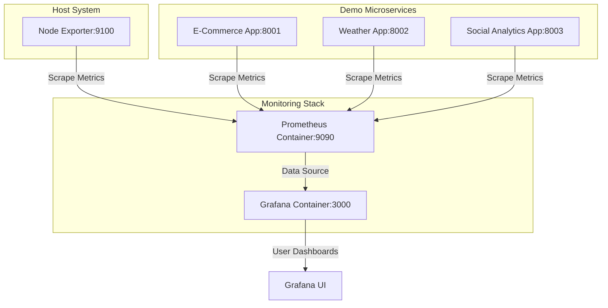

# Cloud-Native Observability Stack with Docker

[](https://prometheus.io/)
[](https://grafana.com/)
[](https://docs.docker.com/compose/)

A Docker-based monitoring project that implements a centralized observability architecture. It monitors host system resources alongside **3 custom-developed microservice demo applications** (E-Commerce, Weather, and Social Media Analytics) using **Prometheus**, **Grafana**, and **Node Exporter**.

---

## 🚀 Architecture Diagram



---

## 🎯 Demo Applications & Custom Metrics

### 1. 🛒 E-Commerce Dashboard (Port 8001)
Simulates a real-time retail transaction engine with custom UI indicators.
* **Key Metrics Monitored:**
  * Active User Sessions (`active_users`)
  * Total Transaction Volume in USD (`total_sales_usd`)
  * Total Completed Orders (`total_orders`)
  * Average Shopping Cart Size (`avg_cart_items`)
  * Conversion Rate (`conversion_rate_percentage`)

### 2. 🌤️ Weather Monitoring Station (Port 8002)
Simulates sensor readouts from localized IoT weather stations.
* **Key Metrics Monitored:**
  * Ambient Temperature in Celsius (`temperature_celsius`)
  * Humidity Percentage (`humidity_percentage`)
  * Atmospheric Pressure in hPa (`atmospheric_pressure_hpa`)
  * Wind Speed in km/h (`wind_speed_kmh`)
  * Rainfall Level in mm (`rainfall_mm`)

### 3. 📱 Social Media Analytics (Port 8003)
Simulates content statistics and user activity feeds across multi-platform networks.
* **Key Metrics Monitored:**
  * Platform Followers Count (`platform_followers_count`)
  * Platform Posts Count (`platform_posts_count`)
  * Total Platform Engagement (Likes, Shares, Comments)
  * Average Engagement Rate (`avg_engagement_rate`)

---

## 🔧 Monitoring Infrastructure

* **Prometheus:** Pulls metrics from custom `/metrics` endpoints across all target containers every 15 seconds.
* **Node Exporter:** Collects core system metrics (CPU load, memory allocation, disk I/O, network traffic) directly from the Linux host.
* **Grafana:** Connects to Prometheus as a datasource and renders interactive dashboards.

---

## 📦 Deployment Instructions (Ubuntu EC2 / Local)

### 1. Pre-requisites
Ensure Docker and Docker Compose are installed on your host system:
```bash
sudo apt update && sudo apt install -y docker.io docker-compose
sudo usermod -aG docker $USER
```

### 2. Spin Up the Stack
Clone the repository and launch the multi-container stack in the background:
```bash
git clone https://github.com/hazzikri/Monitor-Tools.git
cd Monitor-Tools
docker-compose up -d
```

### 3. Access Interfaces
* **Grafana Web UI:** `http://<HOST-IP>:3000` (Default credentials: `admin` / `admin`)
* **Prometheus Status:** `http://<HOST-IP>:9090`
* **Node Exporter Endpoint:** `http://<HOST-IP>:9100/metrics`
* **Demo Microservices:**
  * E-Commerce: `http://<HOST-IP>:8001`
  * Weather: `http://<HOST-IP>:8002`
  * Social Analytics: `http://<HOST-IP>:8003`

---

## 📊 Grafana Configuration
The Grafana container is pre-configured to **auto-provision** the Prometheus datasource, meaning no manual backend setup is required. 
Simply log in, import or build your panels, and start monitoring!
